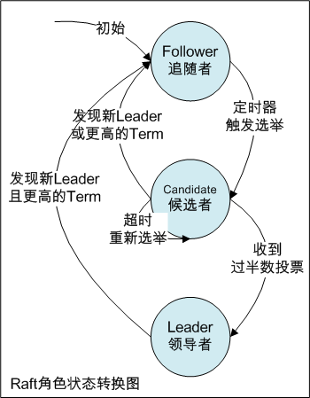

# 分布式一致性算法Raft

Paxos自1990年提出以后，相当长时间内几乎已成为分布式一致性算法的代名词。
但因其难以理解和实现，目前知名实现仅有Chubby、Zookeeper、libpaxos几种，其中Zookeeper使用的ZAB对Paxos做了大量改进。
为此，2013年斯坦福的Diego Ongaro、John Ousterhout，提出了新的更易理解和实现的一致性算法，即Raft。

Raft和Paxos均只要保证n/2+1节点正常，即可服务。相比Paxos，其优势即为易于理解和实现。
Raft采用分而治之的思想，将算法分解为：选择领导者、日志复制、安全性等几个子问题。
它的流程即为：开始时在集群中选举出Leader负责日志复制的管理，Leader接收来自客户端的事务请求（日志），
并将它们复制给集群中的其他节点，然后通知集群中的其他节点提交日志，Leader负责保证其他节点与它的日志同步。
当Leader宕机时，集群其他节点重新发起选举，选出的新的Leader。

### 角色

Raft涉及三种角色：
* Leader：即领导者，负责处理来自客户端的请求，管理日志复制、以及与Follower保持心跳以维持其领导者地位。
* Follower：即追随者，负责响应来自Leader的日志复制请求，响应来自Candidate的选举请求。初始时所有节点均为Follower。
* Candidate：即候选者，负责发起选举投票，Raft启动后或Leader宕机后，一个节点从Follower转为Candidate，并发起选举，选举成功后，由Candidate转为Leader。

如下为Raft角色状态转换图：

### Term（任期）

在Raft中使用了Term（任期）的概念，一轮选举即为一个Term（任期），一个Term中仅能产生一个Leader。
Term使用连续递增的编号表示，初始时所有Follower的Term均为1。
其中某个Follower定时器到期触发选举，其状态转换为Candidate，此时Term加1变为2，然后开始选举，有如下几种可能：

* 1、如果当前Term为2的任期内没有选举出Leader或出现异常，Term递增为3，并开始新一轮选举。
* 2、此轮Term为2的任期内选举出Leader后，如果Leader宕机，此时其他Follower转为Candidate，Term递增，并发起新的选举。
* 3、如果Leader或Candidate发现自己的Term比其他Follower小时，Leader或Candidate转为Follower，Term递增。
* 4、如果Follower发现自己的Term比其他Follower小时，更新Term与其他Follower保持一致。

每次Term递增都将发生新一轮选举，在Raft正常运行过程中，所有节点Term均一致。
如果节点不发生故障，一个Term（任期）会一直保持下去，当某节点收到的请求中Term比当前Term小时拒绝请求。

### 选举

初始时所有节点均为Follower，且定时器时间不同。
某个节点定时器触发选举后，Term递增，该节点由Follower转换为Candidate，向其他节点发起投票请求（RequestVote RPC）。
有如下几种可能：

* 1、收到过半数节点（n/2+1）投票，由Candidate转换为Leader，向其他节点发送心跳以维持领导者地位。
* 2、如果收到其他节点发送的AppendEntries RPC请求，且该节点Term大于当前节点Term，即发现了新的有效领导者，转换为Follower，否则保持Candidate拒绝该请求。
* 3、选举超时，Term递增，重新发起选举。

每轮Term期间，每个节点均只能投票1次，如果多个Candidate均没有接收到过半数投票，则每个Candidate Term递增，重启定时器并重新发起选举。
因定时器时间随机，因此不会多次出现多个Candidate同时发起投票的问题。

### 日志复制

保证节点的一致性，就要保证所有节点都按顺序执行相同的操作序列，日志复制目的即为此。

* 1、Leader接收到客户端事务请求（即日志），先将日志追加到本地Log中，并通过AppendEntries RPC复制给其他Follower。
* 2、Follower接收到日志后，追加到本地Log中，并向Leader发送ACK消息。
* 3、Leader收到过半数Follower的ACK消息后，将日志置为已提交并正式提交日志，通知客户端，并发送AppendEntries RPC请求通知Follower提交日志。

### 安全性

* 1、每个Term期间只能选举一个Leader。
* 2、Leader不会删除或覆盖已有日志条目，只会追加。
* 3、如果相同索引位置的日志条目Term任期号相同，那么认为从头到这个索引位置均相同。
* 4、如果某个日志条目在某任期内提交，那么这个日志条目必然出现在更大的Term任期号的所有领导中。
* 5、如果Leader在某索引位置的日志条目已提交，那么其他节点相同索引位置不会提交不同的日志条目。

### RequestVote RPC和AppendEntries RPC

Raft中节点通信使用两种RPC，即RequestVote RPC和AppendEntries RPC：
RequestVote RPC：即请求投票，由Candidate在选举期间发起。
AppendEntries RPC：即附加条目RPC，由Leader发起，用于日志复制和心跳机制。

### 参考文档

* [寻找一种易于理解的一致性算法（扩展版）](https://github.com/maemual/raft-zh_cn/blob/master/raft-zh_cn.md)
* [一致性算法Raft详解](http://www.solinx.co/archives/415?utm_source=tuicool&utm_medium=referral)
* [Raft 为什么是更易理解的分布式一致性算法](https://www.cnblogs.com/mindwind/p/5231986.html)

### 后记

本文总结的Raft，及之前文章中的Paxos、2PC、3PC均为基于非拜占庭容错的分布式一致性算法，即除考虑消息的丢失、超时、乱序，但不考虑消息被篡改。
从下个文章起，将总结基于拜占庭容错的分布式一致性算法，该算法在比特币、以太坊、及其他区块链产品中广泛使用。